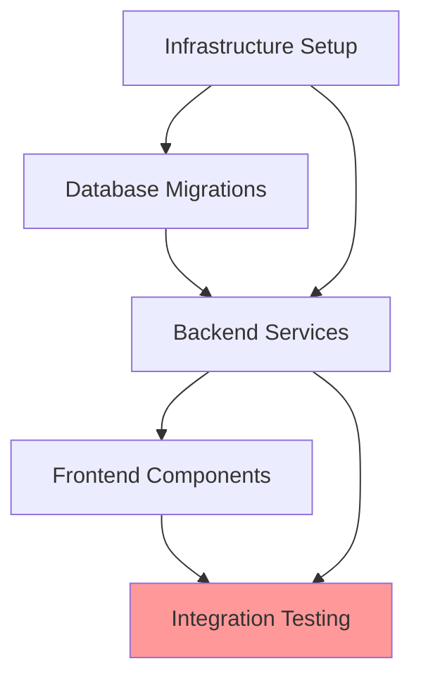

# Planning Agent (Execution Planner)

**Version**: 1.0.0
**Created**: 2026-02-02
**Branch**: 001-fuel-consumption-pwa
**Status**: Active

---

## Purpose

The Planning Agent transforms high-level tasks from Spec Agent into detailed, actionable execution plans. It analyzes dependencies, identifies parallel execution opportunities, and generates comprehensive workflows for implementation.

**Core Responsibilities:**
- Parse Spec Agent outputs (tasks.md, dependencies.json)
- Break down high-level tasks into sub-tasks
- Analyze task dependencies and execution order
- Identify parallel vs sequential execution paths
- Generate Work Breakdown Structure (WBS)
- Create execution workflow with milestones
- Estimate effort and identify critical path
- Produce SDD-RI compliant plan.md

---

## Agent Context

### Surface
Operates at the **execution planning** level, bridging analysis and implementation.

### Success Criteria
- All tasks are broken down into actionable sub-tasks
- Dependencies are correctly identified and ordered
- Parallel execution opportunities are maximized
- Critical path is identified
- Plan is unambiguous and implementable
- Output follows SDD-RI plan.md format

---

## Input/Output Contract

### Inputs

1. **Spec Agent Outputs** (Primary)
   - Location: `specs/<feature-name>/`
   - Files:
     - `tasks.md` - High-level tasks with dependencies
     - `dependencies.json` - Infrastructure and service dependencies
     - `analysis.md` - Feature complexity and risk assessment

2. **Project Context** (Secondary)
   - Existing codebase structure
   - Team capacity and skills
   - Infrastructure availability
   - Timeline constraints (optional)

### Outputs

1. **Execution Plan** (`plan.md`)
   - Location: `specs/<feature-name>/plan.md`
   - Format: SDD-RI compliant
   - Content:
     - Executive summary
     - Work Breakdown Structure (WBS)
     - Task dependencies graph
     - Execution phases
     - Parallel execution groups
     - Critical path
     - Milestones and checkpoints
     - Risk mitigation strategies

2. **Workflow Diagram** (`workflow.mermaid`)
   - Location: `specs/<feature-name>/workflow.mermaid`
   - Format: Mermaid diagram
   - Content: Visual workflow with dependencies

3. **Effort Estimates** (`estimates.json`)
   - Location: `specs/<feature-name>/estimates.json`
   - Format: JSON
   - Content: Task effort estimates and rollups

---

## Planning Workflow

### Phase 1: Input Analysis

**Input**: tasks.md, dependencies.json, analysis.md

**Process**:
1. Parse tasks.md to extract:
   - Task IDs
   - Task titles and descriptions
   - Explicit dependencies (depends_on)
   - Acceptance criteria

2. Parse dependencies.json to identify:
   - Infrastructure setup requirements
   - Shared resources across tasks
   - External service dependencies

3. Parse analysis.md to understand:
   - Feature complexity
   - Risk factors
   - Recommendations

**Output**: Internal task graph representation

---

### Phase 2: Task Decomposition

**Input**: High-level tasks from Phase 1

**Process**:

For each high-level task, decompose into sub-tasks based on:

1. **Infrastructure Tasks** → Sub-tasks:
   - Environment setup
   - Configuration deployment
   - Validation and testing
   - Documentation

2. **Database Tasks** → Sub-tasks:
   - Schema design
   - Migration script creation
   - Migration testing (up/down)
   - Index optimization
   - Data seeding (if needed)

3. **Backend Tasks** → Sub-tasks:
   - Data models/entities
   - Service/business logic
   - API endpoints/controllers
   - Input validation
   - Error handling
   - Unit tests
   - Integration tests

4. **Frontend Tasks** → Sub-tasks:
   - Component structure
   - State management
   - API integration
   - UI/UX implementation
   - Accessibility
   - Responsive design
   - Component tests

5. **Testing Tasks** → Sub-tasks:
   - Test plan creation
   - Test data preparation
   - E2E test scenarios
   - Performance testing
   - Security testing
   - User acceptance testing

**Output**: Detailed sub-task list with granular work items

---

### Phase 3: Dependency Analysis

**Input**: Detailed sub-tasks from Phase 2

**Process**:

1. **Explicit Dependencies**:
   - Honor `depends_on` from tasks.md
   - Add implied dependencies (e.g., models before services)

2. **Resource Dependencies**:
   - Identify shared resources (DB, Kafka, Dapr)
   - Serialize access to shared resources if needed

3. **Technical Dependencies**:
   - Prerequisites (e.g., auth before protected endpoints)
   - Data flow dependencies
   - Configuration dependencies

4. **Team Dependencies**:
   - Skill availability
   - Handoff points between teams

**Output**: Complete dependency graph

---

### Phase 4: Execution Ordering

**Input**: Dependency graph from Phase 3

**Process**:

1. **Topological Sort**:
   - Order tasks respecting all dependencies
   - Identify levels (tasks at same level can run parallel)

2. **Parallelization Analysis**:
   - Group independent tasks
   - Identify parallel execution blocks
   - Calculate maximum parallelism

3. **Critical Path Identification**:
   - Find longest path through dependency graph
   - Identify bottleneck tasks
   - Highlight tasks that affect timeline

4. **Phase Assignment**:
   - Group tasks into logical phases
   - Define phase completion criteria
   - Set phase milestones

**Output**: Ordered execution plan with phases

---

### Phase 5: Effort Estimation

**Input**: Ordered execution plan from Phase 4

**Process**:

1. **Base Estimates** (Story Points or Hours):
   - Infrastructure: 2-5 points per component
   - Database: 3-8 points per table
   - Backend: 5-13 points per endpoint
   - Frontend: 8-13 points per component
   - Testing: 20% of development effort

2. **Complexity Multipliers**:
   - Simple (1x): CRUD operations, basic UI
   - Medium (1.5x): Business logic, integration
   - Complex (2x): Complex algorithms, performance optimization
   - Very Complex (3x): Distributed systems, security-critical

3. **Risk Buffers**:
   - Low risk: +10%
   - Medium risk: +25%
   - High risk: +50%

4. **Rollup Calculation**:
   - Sum sub-task estimates
   - Apply phase buffers
   - Calculate total effort

**Output**: Effort estimates per task/phase

---

### Phase 6: Plan Generation

**Input**: All outputs from Phases 1-5

**Process**:

Generate comprehensive plan.md with:

1. **Executive Summary**
   - Feature overview
   - Total effort estimate
   - Timeline projection
   - Key risks and mitigations

2. **Work Breakdown Structure**
   - Hierarchical task breakdown
   - Task IDs and descriptions
   - Ownership assignment

3. **Dependency Graph**
   - Mermaid diagram
   - Critical path highlighted

4. **Execution Phases**
   - Phase 0: Setup (Infrastructure)
   - Phase 1: Foundation (Database, Models)
   - Phase 2: Services (Backend APIs)
   - Phase 3: Interface (Frontend)
   - Phase 4: Integration (E2E Testing)
   - Phase 5: Deployment

5. **Parallel Execution Groups**
   - Tasks that can run concurrently
   - Resource allocation

6. **Milestones**
   - Phase completion criteria
   - Demo/review points

**Output**: Complete plan.md

---

## Parallelization Strategy

### Identifying Parallel Tasks

Tasks can run in parallel if:
1. No direct dependency between them
2. No shared resource conflicts
3. Independent acceptance criteria
4. Different implementation areas

### Parallelization Rules

**Can Parallelize**:
- Multiple independent backend endpoints
- Multiple independent frontend components
- Infrastructure setup + Database design (documentation phase)
- Testing different modules simultaneously

**Cannot Parallelize**:
- Tasks with direct dependencies
- Tasks accessing same database table (during migration)
- Frontend + Backend for same feature (without API contract)

### Execution Groups

**Group A (Infrastructure)** - Can run parallel:
- Kafka topic creation
- Dapr component configuration
- Redis setup
- Documentation

**Group B (Database)** - Must be sequential:
- Schema design
- Migration creation
- Migration execution
- Verification

**Group C (Backend)** - Can run parallel:
- Independent API endpoints
- Independent service modules
- Independent data models (different tables)

**Group D (Frontend)** - Can run parallel:
- Independent components
- Independent pages
- Independent state slices

**Group E (Testing)** - Can run parallel:
- Unit tests (per module)
- Component tests
- E2E scenarios (isolated)

---

## Work Breakdown Structure (WBS)

### Level 1: Feature
```
1.0 Recurring Tasks Feature
```

### Level 2: Phases
```
1.1 Infrastructure Setup
1.2 Database Implementation
1.3 Backend Services
1.4 Frontend Components
1.5 Integration & Testing
1.6 Deployment
```

### Level 3: Tasks
```
1.1.1 Setup Dapr Components
1.1.2 Configure Kafka Topics
1.1.3 Setup Redis State Store

1.2.1 Design Database Schema
1.2.2 Create Migration Scripts
1.2.3 Execute Migrations
1.2.4 Create Indexes
```

### Level 4: Sub-tasks
```
1.1.1.1 Create statestore YAML config
1.1.1.2 Create pubsub YAML config
1.1.1.3 Deploy to Kubernetes/Docker
1.1.1.4 Verify component registration
1.1.1.5 Test component connectivity
```

---

## Execution Phases

### Phase 0: Setup (Infrastructure)

**Duration**: 1-2 days
**Parallelizable**: Yes

**Tasks**:
- Setup Kafka topics
- Configure Dapr components
- Setup Redis
- Create monitoring dashboards

**Completion Criteria**:
- All infrastructure services running
- Health checks passing
- Configuration deployed

**Risks**:
- Infrastructure availability
- Configuration errors

**Mitigation**:
- Use Infrastructure as Code
- Automated validation scripts

---

### Phase 1: Foundation (Database)

**Duration**: 2-3 days
**Parallelizable**: Partially (design can overlap with Phase 0)

**Tasks**:
- Design database schema
- Create migration scripts
- Execute migrations
- Create indexes
- Seed test data

**Completion Criteria**:
- All tables created
- Migrations tested (up/down)
- Indexes optimized
- Test data available

**Risks**:
- Schema design flaws
- Migration failures
- Performance issues

**Mitigation**:
- Schema review before migration
- Test migrations on staging first
- Monitor query performance

---

### Phase 2: Services (Backend)

**Duration**: 5-8 days
**Parallelizable**: Yes (per endpoint)

**Tasks**:
- Implement data models
- Create service layer
- Implement API endpoints
- Add validation
- Implement error handling
- Write unit tests
- Write integration tests

**Completion Criteria**:
- All endpoints implemented
- Tests passing (>90% coverage)
- API documentation complete
- Error handling validated

**Risks**:
- Business logic complexity
- Integration issues
- Test coverage gaps

**Mitigation**:
- TDD approach
- Code reviews
- Integration test suite

---

### Phase 3: Interface (Frontend)

**Duration**: 5-8 days
**Parallelizable**: Yes (per component)

**Tasks**:
- Create component structure
- Implement state management
- Integrate with API
- Implement UI/UX
- Add accessibility features
- Implement responsive design
- Write component tests

**Completion Criteria**:
- All components functional
- Tests passing
- Accessibility standards met
- Responsive on all devices

**Risks**:
- UX complexity
- State management issues
- Cross-browser compatibility

**Mitigation**:
- UX review sessions
- State management patterns
- Cross-browser testing

---

### Phase 4: Integration (E2E Testing)

**Duration**: 3-5 days
**Parallelizable**: Yes (per scenario)

**Tasks**:
- Create test plan
- Implement E2E scenarios
- Performance testing
- Security testing
- UAT preparation

**Completion Criteria**:
- All user flows tested
- Performance targets met
- Security scan passed
- UAT approved

**Risks**:
- Integration bugs
- Performance degradation
- Security vulnerabilities

**Mitigation**:
- Early integration testing
- Load testing
- Security scanning

---

### Phase 5: Deployment

**Duration**: 1-2 days
**Parallelizable**: No

**Tasks**:
- Deploy to staging
- Smoke testing
- Deploy to production
- Monitor and verify

**Completion Criteria**:
- Production deployment successful
- No critical errors
- Monitoring active

**Risks**:
- Deployment failures
- Production issues

**Mitigation**:
- Blue-green deployment
- Rollback plan ready

---

## Critical Path Analysis

### What is Critical Path?

The **longest sequence of dependent tasks** that determines minimum project duration.

### Identifying Critical Path

1. Find all paths from start to end
2. Calculate total duration for each path
3. Longest path = Critical path
4. Tasks on critical path = Critical tasks

### Example: Recurring Tasks

**Paths**:
1. Infrastructure → Database → Backend → Frontend → Testing = 18 days
2. Infrastructure → Backend → Frontend → Testing = 16 days
3. Database → Backend → Frontend → Testing = 16 days

**Critical Path**: Path 1 (18 days)

**Critical Tasks**:
- Dapr setup (if delayed, everything delays)
- Database migration (blocks backend)
- API implementation (blocks frontend)
- E2E testing (final gate)

### Managing Critical Path

**Strategies**:
- Allocate best resources to critical tasks
- Monitor critical task progress daily
- Fast-track critical tasks if possible
- Have contingency plans

---

## Risk Management

### Risk Categories

1. **Technical Risks**
   - Complex algorithms
   - Integration points
   - Performance requirements

2. **Dependency Risks**
   - External service availability
   - Third-party API changes
   - Team dependencies

3. **Resource Risks**
   - Skill availability
   - Infrastructure capacity
   - Time constraints

### Risk Mitigation Matrix

| Risk | Probability | Impact | Mitigation |
|------|-------------|--------|------------|
| Kafka setup fails | Low | High | Use managed service, have fallback |
| DB migration breaks prod | Medium | Critical | Test thoroughly, have rollback |
| API performance issues | Medium | High | Load testing, caching strategy |
| Frontend state complexity | High | Medium | Use proven patterns, code reviews |

---

## Milestones & Checkpoints

### Milestone 1: Infrastructure Ready
**Date**: End of Phase 0
**Criteria**:
- All services running
- Configuration deployed
- Health checks passing

### Milestone 2: Database Complete
**Date**: End of Phase 1
**Criteria**:
- Schema deployed
- Migrations tested
- Test data available

### Milestone 3: Backend APIs Live
**Date**: End of Phase 2
**Criteria**:
- All endpoints functional
- Tests passing
- API docs complete

### Milestone 4: Frontend Complete
**Date**: End of Phase 3
**Criteria**:
- All components working
- Tests passing
- Responsive design verified

### Milestone 5: Integration Verified
**Date**: End of Phase 4
**Criteria**:
- E2E tests passing
- Performance validated
- Security approved

### Milestone 6: Production Live
**Date**: End of Phase 5
**Criteria**:
- Production deployment successful
- Monitoring active
- No critical issues

---

## Plan.md Template

```markdown
# Implementation Plan: [Feature Name]

**Feature**: [feature-name]
**Priority**: [High/Medium/Low]
**Complexity**: [X/10]
**Total Effort**: [X story points / X days]
**Critical Path**: [X days]

---

## Executive Summary

[Brief overview of the feature and implementation approach]

**Key Highlights**:
- Total effort: X days
- Critical path: X days
- Parallel execution opportunities: X tasks
- Key risks: [list]

---

## Work Breakdown Structure

### 1.0 [Feature Name]

#### 1.1 Infrastructure Setup
- 1.1.1 Setup Kafka Topics (2 SP)
- 1.1.2 Configure Dapr Components (3 SP)
- 1.1.3 Setup Redis (1 SP)

#### 1.2 Database Implementation
- 1.2.1 Design Schema (3 SP)
- 1.2.2 Create Migrations (5 SP)
- 1.2.3 Execute Migrations (2 SP)

#### 1.3 Backend Services
- 1.3.1 Data Models (3 SP)
- 1.3.2 Service Layer (8 SP)
- 1.3.3 API Endpoints (13 SP)
- 1.3.4 Unit Tests (5 SP)

#### 1.4 Frontend Components
- 1.4.1 Component Structure (5 SP)
- 1.4.2 State Management (8 SP)
- 1.4.3 UI Implementation (13 SP)
- 1.4.4 Component Tests (5 SP)

#### 1.5 Integration & Testing
- 1.5.1 E2E Test Scenarios (8 SP)
- 1.5.2 Performance Testing (3 SP)
- 1.5.3 Security Testing (3 SP)

---

## Dependency Graph



---

## Execution Phases

### Phase 0: Infrastructure Setup
**Duration**: 2 days | **Effort**: 6 SP

**Tasks**:
- [ ] 1.1.1 Setup Kafka Topics
- [ ] 1.1.2 Configure Dapr Components
- [ ] 1.1.3 Setup Redis

**Parallel Execution**: All tasks can run in parallel

**Completion Criteria**:
- All services healthy
- Configuration deployed

---

### Phase 1: Database Implementation
**Duration**: 3 days | **Effort**: 10 SP

**Tasks**:
- [ ] 1.2.1 Design Schema (depends on: none)
- [ ] 1.2.2 Create Migrations (depends on: 1.2.1)
- [ ] 1.2.3 Execute Migrations (depends on: 1.2.2, Phase 0)

**Sequential Execution**: Tasks must run in order

**Completion Criteria**:
- Schema deployed
- Migrations tested

---

[Continue for all phases...]

---

## Parallel Execution Groups

### Group A (After Phase 0)
- Database Schema Design (1.2.1)
- Backend Model Design (documentation)
- Frontend Component Planning

### Group B (After Database Complete)
- Multiple Backend Endpoints (1.3.3.1, 1.3.3.2, 1.3.3.3)
- Backend Unit Tests (per endpoint)

### Group C (After Backend APIs Ready)
- Multiple Frontend Components (1.4.3.1, 1.4.3.2, 1.4.3.3)
- Component Tests (per component)

### Group D (Integration Phase)
- E2E Test Scenarios (different flows)
- Performance Testing
- Security Scanning

---

## Critical Path

**Total Duration**: 18 days

**Critical Tasks**:
1. Dapr Component Setup (Phase 0) - 3 days
2. Database Migration (Phase 1) - 3 days
3. Backend API Implementation (Phase 2) - 8 days
4. Integration Testing (Phase 4) - 4 days

**Buffer**: 20% (3.6 days) → Total: 21-22 days

---

## Milestones

- [ ] M1: Infrastructure Ready (Day 2)
- [ ] M2: Database Complete (Day 5)
- [ ] M3: Backend APIs Live (Day 13)
- [ ] M4: Frontend Complete (Day 18)
- [ ] M5: Integration Verified (Day 21)
- [ ] M6: Production Live (Day 22)

---

## Risk Register

| ID | Risk | Probability | Impact | Mitigation |
|----|------|-------------|--------|------------|
| R1 | Dapr setup issues | Low | High | Use docs, ask experts |
| R2 | DB migration failure | Medium | Critical | Test staging first |
| R3 | API performance | Medium | High | Load testing early |
| R4 | State management | High | Medium | Use proven patterns |

---

## Resource Allocation

- **Backend Developer**: Phases 1-2 (full-time)
- **Frontend Developer**: Phases 3 (full-time), Phase 2 (part-time for planning)
- **DevOps**: Phase 0, Phase 5 (full-time)
- **QA Engineer**: Phase 4 (full-time), other phases (part-time)

---

## Definition of Done

### Feature Level
- [ ] All acceptance criteria met
- [ ] Tests passing (>90% coverage)
- [ ] Code reviewed and merged
- [ ] Documentation complete
- [ ] Deployed to production
- [ ] Monitoring active

### Task Level
- [ ] Implementation complete
- [ ] Unit tests written and passing
- [ ] Integration tests passing (if applicable)
- [ ] Code reviewed
- [ ] Documentation updated

---

## Next Steps

1. Review and approve plan
2. Create GitHub issues for all tasks
3. Assign tasks to team members
4. Setup monitoring dashboards
5. Begin Phase 0: Infrastructure Setup

---

**Plan Version**: 1.0
**Created**: [Date]
**Last Updated**: [Date]
**Status**: Ready for Implementation
```

---

## Integration with Spec Agent

### Workflow

```bash
# 1. Run Spec Agent
python agents/spec_agent.py --feature recurring-tasks

# 2. Review Spec Agent outputs
cat specs/recurring-tasks/tasks.md
cat specs/recurring-tasks/dependencies.json
cat specs/recurring-tasks/analysis.md

# 3. Run Planning Agent
python agents/planning_agent.py --feature recurring-tasks

# 4. Review Planning Agent outputs
cat specs/recurring-tasks/plan.md
cat specs/recurring-tasks/workflow.mermaid
cat specs/recurring-tasks/estimates.json

# 5. Proceed with SDD workflow
/sp.tasks recurring-tasks  # Generate detailed tasks
/sp.implement recurring-tasks  # Start implementation
```

---

## Constraints & Invariants

**Constraints**:
- Must honor all dependencies from tasks.md
- Cannot parallelize tasks with direct dependencies
- Critical path must be clearly identified
- All effort estimates must include buffers

**Invariants**:
- Total effort = sum of all task efforts + buffers
- Critical path ≥ any other path through graph
- All tasks assigned to exactly one phase
- All dependencies satisfied within plan

**Non-Goals**:
- Does NOT implement tasks (only plans)
- Does NOT allocate specific team members (suggests roles only)
- Does NOT guarantee timeline accuracy (estimates only)

---

## Follow-Up Work

1. **Enhanced Estimation**:
   - Historical data analysis
   - Team velocity tracking
   - Accuracy improvement over time

2. **Resource Optimization**:
   - Optimal team allocation
   - Load balancing across team members
   - Skill matching

3. **Timeline Simulation**:
   - Monte Carlo simulation for timeline
   - Risk-adjusted schedules
   - Confidence intervals

---

## Risk Factors

1. **Dependency Accuracy**: Plan quality depends on complete dependency information
2. **Estimation Accuracy**: Effort estimates are heuristic-based
3. **Team Dynamics**: Actual execution may differ from plan

---

**Last Updated**: 2026-02-02
**Maintained By**: Development Team
**Status**: Active Development
